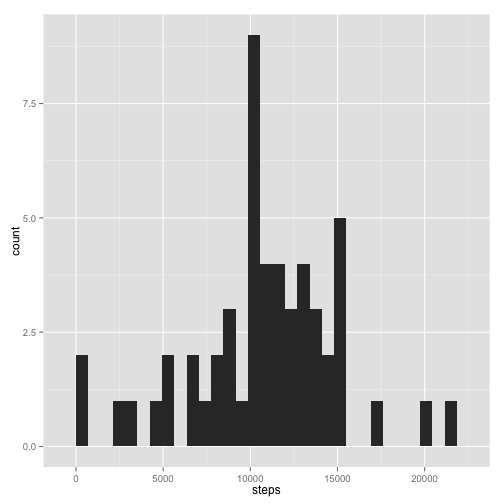
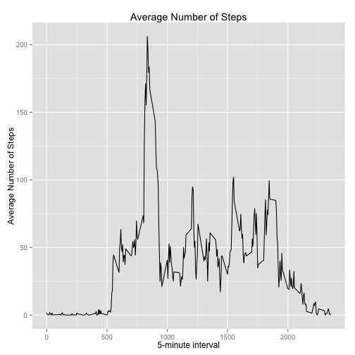
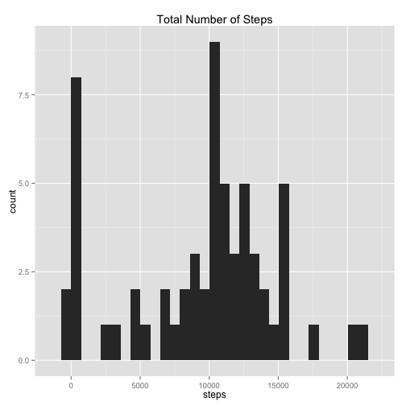
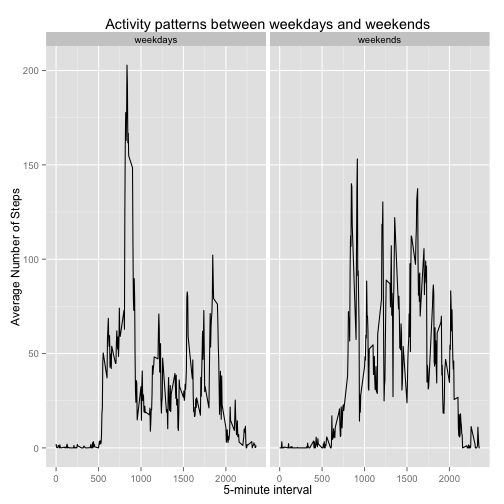

## Loading and preprocessing the data

Download and load data from a csv file containing personal activity monitoring device.


```r
# install/load require packages
if (!require("ggplot2")) {
    suppressMessages(install.packages('ggplot2', repos="http://cran.rstudio.com/"))
}  
```

```
## Loading required package: ggplot2
```

```r
if (!require("dplyr")) {
    suppressMessages(install.packages('dplyr', repos="http://cran.rstudio.com/"))
}
```

```
## Loading required package: dplyr
## 
## Attaching package: 'dplyr'
## 
## The following objects are masked from 'package:stats':
## 
##     filter, lag
## 
## The following objects are masked from 'package:base':
## 
##     intersect, setdiff, setequal, union
```

```r
if (!require("zoo")) {
    suppressMessages(install.packages('zoo', repos="http://cran.rstudio.com/") )
}
```

```
## Loading required package: zoo
## 
## Attaching package: 'zoo'
## 
## The following objects are masked from 'package:base':
## 
##     as.Date, as.Date.numeric
```

```r
if (!require("xtable")) {
    suppressMessages(install.packages('xtable', repos="http://cran.rstudio.com/") )
}
```

```
## Loading required package: xtable
```

```r
suppressMessages(library(xtable))                
suppressMessages(library(ggplot2))
suppressMessages(library(dplyr))
suppressMessages(library('zoo'))

fileUrl <- "https://d396qusza40orc.cloudfront.net/repdata%2Fdata%2Factivity.zip"
download.file(fileUrl, destfile = "activity.csv", method = "curl")
unzip("activity.zip")
activity <- read.csv("activity.csv")

summary(activity)
str(activity)
```

Measured Data summary

```r
summary(activity)
```

```
##      steps                date          interval     
##  Min.   :  0.00   2012-10-01:  288   Min.   :   0.0  
##  1st Qu.:  0.00   2012-10-02:  288   1st Qu.: 588.8  
##  Median :  0.00   2012-10-03:  288   Median :1177.5  
##  Mean   : 37.38   2012-10-04:  288   Mean   :1177.5  
##  3rd Qu.: 12.00   2012-10-05:  288   3rd Qu.:1766.2  
##  Max.   :806.00   2012-10-06:  288   Max.   :2355.0  
##  NA's   :2304     (Other)   :15840
```

```r
str(activity)
```

```
## 'data.frame':	17568 obs. of  3 variables:
##  $ steps   : int  NA NA NA NA NA NA NA NA NA NA ...
##  $ date    : Factor w/ 61 levels "2012-10-01","2012-10-02",..: 1 1 1 1 1 1 1 1 1 1 ...
##  $ interval: int  0 5 10 15 20 25 30 35 40 45 ...
```


## What is mean total number of steps taken per day?
For this part of the assignment, you can ignore the missing values in the dataset.  
1. Make a histogram of the total number of steps taken each day

```r
daily_step <- as.data.frame(activity %>% group_by(date) %>%  summarise_each(funs(sum)))
# build a plot for 'steps' column
ggplot(daily_step, aes(x = steps)) + geom_histogram()
```

```
## stat_bin: binwidth defaulted to range/30. Use 'binwidth = x' to adjust this.
```

 

2. Calculate and report the **mean** and **median** total number of steps taken per day.  

```r
step_avg <-  activity %>% group_by(date) %>%  summarise_each(funs(mean))
as.data.frame(step_avg[, c("date","steps")])
```

```
##          date      steps
## 1  2012-10-01         NA
## 2  2012-10-02  0.4375000
## 3  2012-10-03 39.4166667
## 4  2012-10-04 42.0694444
## 5  2012-10-05 46.1597222
## 6  2012-10-06 53.5416667
## 7  2012-10-07 38.2465278
## 8  2012-10-08         NA
## 9  2012-10-09 44.4826389
## 10 2012-10-10 34.3750000
## 11 2012-10-11 35.7777778
## 12 2012-10-12 60.3541667
## 13 2012-10-13 43.1458333
## 14 2012-10-14 52.4236111
## 15 2012-10-15 35.2048611
## 16 2012-10-16 52.3750000
## 17 2012-10-17 46.7083333
## 18 2012-10-18 34.9166667
## 19 2012-10-19 41.0729167
## 20 2012-10-20 36.0937500
## 21 2012-10-21 30.6284722
## 22 2012-10-22 46.7361111
## 23 2012-10-23 30.9652778
## 24 2012-10-24 29.0104167
## 25 2012-10-25  8.6527778
## 26 2012-10-26 23.5347222
## 27 2012-10-27 35.1354167
## 28 2012-10-28 39.7847222
## 29 2012-10-29 17.4236111
## 30 2012-10-30 34.0937500
## 31 2012-10-31 53.5208333
## 32 2012-11-01         NA
## 33 2012-11-02 36.8055556
## 34 2012-11-03 36.7048611
## 35 2012-11-04         NA
## 36 2012-11-05 36.2465278
## 37 2012-11-06 28.9375000
## 38 2012-11-07 44.7326389
## 39 2012-11-08 11.1770833
## 40 2012-11-09         NA
## 41 2012-11-10         NA
## 42 2012-11-11 43.7777778
## 43 2012-11-12 37.3784722
## 44 2012-11-13 25.4722222
## 45 2012-11-14         NA
## 46 2012-11-15  0.1423611
## 47 2012-11-16 18.8923611
## 48 2012-11-17 49.7881944
## 49 2012-11-18 52.4652778
## 50 2012-11-19 30.6979167
## 51 2012-11-20 15.5277778
## 52 2012-11-21 44.3993056
## 53 2012-11-22 70.9270833
## 54 2012-11-23 73.5902778
## 55 2012-11-24 50.2708333
## 56 2012-11-25 41.0902778
## 57 2012-11-26 38.7569444
## 58 2012-11-27 47.3819444
## 59 2012-11-28 35.3576389
## 60 2012-11-29 24.4687500
## 61 2012-11-30         NA
```

```r
step_med <-  activity %>% group_by(date) %>%  summarise_each(funs(median))
as.data.frame(step_med[, c("date","steps")])
```

```
##          date steps
## 1  2012-10-01    NA
## 2  2012-10-02     0
## 3  2012-10-03     0
## 4  2012-10-04     0
## 5  2012-10-05     0
## 6  2012-10-06     0
## 7  2012-10-07     0
## 8  2012-10-08    NA
## 9  2012-10-09     0
## 10 2012-10-10     0
## 11 2012-10-11     0
## 12 2012-10-12     0
## 13 2012-10-13     0
## 14 2012-10-14     0
## 15 2012-10-15     0
## 16 2012-10-16     0
## 17 2012-10-17     0
## 18 2012-10-18     0
## 19 2012-10-19     0
## 20 2012-10-20     0
## 21 2012-10-21     0
## 22 2012-10-22     0
## 23 2012-10-23     0
## 24 2012-10-24     0
## 25 2012-10-25     0
## 26 2012-10-26     0
## 27 2012-10-27     0
## 28 2012-10-28     0
## 29 2012-10-29     0
## 30 2012-10-30     0
## 31 2012-10-31     0
## 32 2012-11-01    NA
## 33 2012-11-02     0
## 34 2012-11-03     0
## 35 2012-11-04    NA
## 36 2012-11-05     0
## 37 2012-11-06     0
## 38 2012-11-07     0
## 39 2012-11-08     0
## 40 2012-11-09    NA
## 41 2012-11-10    NA
## 42 2012-11-11     0
## 43 2012-11-12     0
## 44 2012-11-13     0
## 45 2012-11-14    NA
## 46 2012-11-15     0
## 47 2012-11-16     0
## 48 2012-11-17     0
## 49 2012-11-18     0
## 50 2012-11-19     0
## 51 2012-11-20     0
## 52 2012-11-21     0
## 53 2012-11-22     0
## 54 2012-11-23     0
## 55 2012-11-24     0
## 56 2012-11-25     0
## 57 2012-11-26     0
## 58 2012-11-27     0
## 59 2012-11-28     0
## 60 2012-11-29     0
## 61 2012-11-30    NA
```

## What is the average daily activity pattern?  
1. Make a time series plot of the 5-minute interval (x-axis) and the average number of steps taken, averaged across all days (y-axis)

```r
suppressWarnings(step_avg_interval <-  activity %>% 
  group_by(interval) %>%  summarise_each(funs(mean(., na.rm = TRUE))))
suppressWarnings(ggplot(step_avg_interval, aes(interval, steps)) +
                   geom_line() + xlab("5-minute interval") + 
                   ggtitle("Average Number of Steps") +
                   ylab("Average Number of Steps") )
```

 
  
2. Which 5-minute interval, on average across all the days in the dataset, contains the maximum number of steps?  


```r
max_avg_step <- max(step_avg_interval$steps, na.rm = T)
       (step_avg_interval[step_avg_interval$steps==max_avg_step,])$interval[1]
```

```
## [1] 835
```
		


## Imputing missing values

Note that there are a number of days/intervals where there are missing
values (coded as `NA`). The presence of missing days may introduce
bias into some calculations or summaries of the data.

1. Calculate and report the total number of missing values in the dataset (i.e. the total number of rows with `NA`s)  


```r
count(activity[activity$steps == 'NA' | activity$date == 'NA' | activity$interval=='NA', ])$n
```

```
## [1] 2304
```

2. Devise a strategy for filling in all of the missing values in the dataset. The strategy does not need to be sophisticated. For example, you could use the mean/median for that day, or the mean for that 5-minute interval, etc.    
Since almost 13% of the rows has missing data, we need to fillin the missing data. zoo package has very good.  
Methods for filling in the gap in data.  
  - na.locf()	-	function for replacing each NA with the most recent non-NA prior to it.  
  - na.appox()	-	functions for replacing each NA with linear interpolated values.
  - na.spline()	-	functions for replacing each NA with cubic spline interpolated values.
			

3. Create a new dataset that is equal to the original dataset but with the missing data filled in.  
Creating new data frame named **activity_prime** with missing value filled in with cubic spline interpolated values.  

```r
  activity_prime <- transform(activity, steps = na.spline(steps) )
```

4. Make a histogram of the total number of steps taken each day and Calculate and report the **mean** and **median** total number of steps taken per day. Do these values differ from the estimates from the first part of the assignment? What is the impact of imputing missing data on the estimates of the total daily number of steps? 


```r
daily_step_prime <- as.data.frame(activity_prime %>% group_by(date) %>%  summarise_each(funs(sum)))
ggplot(daily_step_prime, aes(x = steps)) + geom_histogram() +
  ggtitle("Total Number of Steps")
```

```
## stat_bin: binwidth defaulted to range/30. Use 'binwidth = x' to adjust this.
```

 

  
 **mean** and **median** total number of steps taken per day.  

```r
step_avg_prime <-  activity_prime %>% group_by(date) %>%  summarise_each(funs(mean))
as.data.frame(step_avg_prime[, c("date","steps")]	)
```

```
##          date          steps
## 1  2012-10-01  3.307033e-145
## 2  2012-10-02   4.375000e-01
## 3  2012-10-03   3.941667e+01
## 4  2012-10-04   4.206944e+01
## 5  2012-10-05   4.615972e+01
## 6  2012-10-06   5.354167e+01
## 7  2012-10-07   3.824653e+01
## 8  2012-10-08  -1.098810e+00
## 9  2012-10-09   4.448264e+01
## 10 2012-10-10   3.437500e+01
## 11 2012-10-11   3.577778e+01
## 12 2012-10-12   6.035417e+01
## 13 2012-10-13   4.314583e+01
## 14 2012-10-14   5.242361e+01
## 15 2012-10-15   3.520486e+01
## 16 2012-10-16   5.237500e+01
## 17 2012-10-17   4.670833e+01
## 18 2012-10-18   3.491667e+01
## 19 2012-10-19   4.107292e+01
## 20 2012-10-20   3.609375e+01
## 21 2012-10-21   3.062847e+01
## 22 2012-10-22   4.673611e+01
## 23 2012-10-23   3.096528e+01
## 24 2012-10-24   2.901042e+01
## 25 2012-10-25   8.652778e+00
## 26 2012-10-26   2.353472e+01
## 27 2012-10-27   3.513542e+01
## 28 2012-10-28   3.978472e+01
## 29 2012-10-29   1.742361e+01
## 30 2012-10-30   3.409375e+01
## 31 2012-10-31   5.352083e+01
## 32 2012-11-01  -1.059162e-07
## 33 2012-11-02   3.680556e+01
## 34 2012-11-03   3.670486e+01
## 35 2012-11-04  -1.006038e-16
## 36 2012-11-05   3.624653e+01
## 37 2012-11-06   2.893750e+01
## 38 2012-11-07   4.473264e+01
## 39 2012-11-08   1.117708e+01
## 40 2012-11-09   1.202844e-07
## 41 2012-11-10   5.477012e-08
## 42 2012-11-11   4.377778e+01
## 43 2012-11-12   3.737847e+01
## 44 2012-11-13   2.547222e+01
## 45 2012-11-14  -1.505760e-06
## 46 2012-11-15   1.423611e-01
## 47 2012-11-16   1.889236e+01
## 48 2012-11-17   4.978819e+01
## 49 2012-11-18   5.246528e+01
## 50 2012-11-19   3.069792e+01
## 51 2012-11-20   1.552778e+01
## 52 2012-11-21   4.439931e+01
## 53 2012-11-22   7.092708e+01
## 54 2012-11-23   7.359028e+01
## 55 2012-11-24   5.027083e+01
## 56 2012-11-25   4.109028e+01
## 57 2012-11-26   3.875694e+01
## 58 2012-11-27   4.738194e+01
## 59 2012-11-28   3.535764e+01
## 60 2012-11-29   2.446875e+01
## 61 2012-11-30  -2.367067e-09
```

```r
step_med_prime <-  activity_prime %>% group_by(date) %>%  summarise_each(funs(median))
as.data.frame(step_med_prime[, c("date","steps")])
```

```
##          date          steps
## 1  2012-10-01  2.488857e-145
## 2  2012-10-02   0.000000e+00
## 3  2012-10-03   0.000000e+00
## 4  2012-10-04   0.000000e+00
## 5  2012-10-05   0.000000e+00
## 6  2012-10-06   0.000000e+00
## 7  2012-10-07   0.000000e+00
## 8  2012-10-08  -1.198424e+00
## 9  2012-10-09   0.000000e+00
## 10 2012-10-10   0.000000e+00
## 11 2012-10-11   0.000000e+00
## 12 2012-10-12   0.000000e+00
## 13 2012-10-13   0.000000e+00
## 14 2012-10-14   0.000000e+00
## 15 2012-10-15   0.000000e+00
## 16 2012-10-16   0.000000e+00
## 17 2012-10-17   0.000000e+00
## 18 2012-10-18   0.000000e+00
## 19 2012-10-19   0.000000e+00
## 20 2012-10-20   0.000000e+00
## 21 2012-10-21   0.000000e+00
## 22 2012-10-22   0.000000e+00
## 23 2012-10-23   0.000000e+00
## 24 2012-10-24   0.000000e+00
## 25 2012-10-25   0.000000e+00
## 26 2012-10-26   0.000000e+00
## 27 2012-10-27   0.000000e+00
## 28 2012-10-28   0.000000e+00
## 29 2012-10-29   0.000000e+00
## 30 2012-10-30   0.000000e+00
## 31 2012-10-31   0.000000e+00
## 32 2012-11-01  -1.155181e-07
## 33 2012-11-02   0.000000e+00
## 34 2012-11-03   0.000000e+00
## 35 2012-11-04  -1.097241e-16
## 36 2012-11-05   0.000000e+00
## 37 2012-11-06   0.000000e+00
## 38 2012-11-07   0.000000e+00
## 39 2012-11-08   0.000000e+00
## 40 2012-11-09   1.392776e-07
## 41 2012-11-10   4.938912e-08
## 42 2012-11-11   0.000000e+00
## 43 2012-11-12   0.000000e+00
## 44 2012-11-13   0.000000e+00
## 45 2012-11-14  -1.642265e-06
## 46 2012-11-15   0.000000e+00
## 47 2012-11-16   0.000000e+00
## 48 2012-11-17   0.000000e+00
## 49 2012-11-18   0.000000e+00
## 50 2012-11-19   0.000000e+00
## 51 2012-11-20   0.000000e+00
## 52 2012-11-21   0.000000e+00
## 53 2012-11-22   0.000000e+00
## 54 2012-11-23   0.000000e+00
## 55 2012-11-24   0.000000e+00
## 56 2012-11-25   0.000000e+00
## 57 2012-11-26   0.000000e+00
## 58 2012-11-27   0.000000e+00
## 59 2012-11-28   0.000000e+00
## 60 2012-11-29   0.000000e+00
## 61 2012-11-30  -1.781444e-09
```


Change in total daily steps after imputing missing data.  


```r
sum(activity$steps, na.rm=T) - round(sum(activity_prime$steps)) 
```

```
## [1] 316
```
## Are there differences in activity patterns between weekdays and weekends?  


```r
suppressWarnings(activity_prime <- transform(activity_prime, 
                 weekday = factor(weekdays(as.Date(activity_prime$date)) %in% 
                                   c("Monday","Tuesday","Wednesday","Thursday","Friday"),
                                 levels = c(TRUE, FALSE),
                                 labels=c("weekdays","weekends"))))

suppressWarnings(step_avg_interval <- activity_prime %>% group_by(weekday,interval) %>% summarise_each(funs(mean)))
ggplot(step_avg_interval, aes(interval, steps)) + 
  geom_line() + 
  xlab("5-minute interval") + 
  ylab("Average Number of Steps") + 
  facet_grid(. ~ weekday) +
  ggtitle("Activity patterns between weekdays and weekends")
```

 


